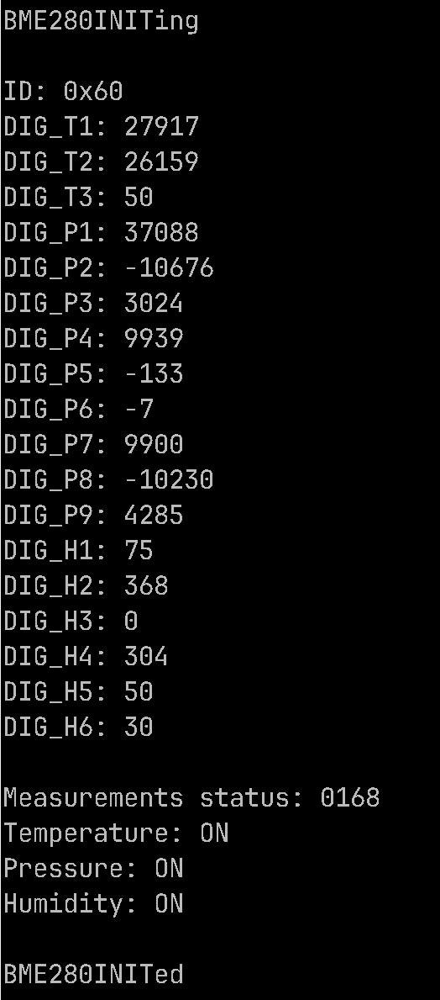
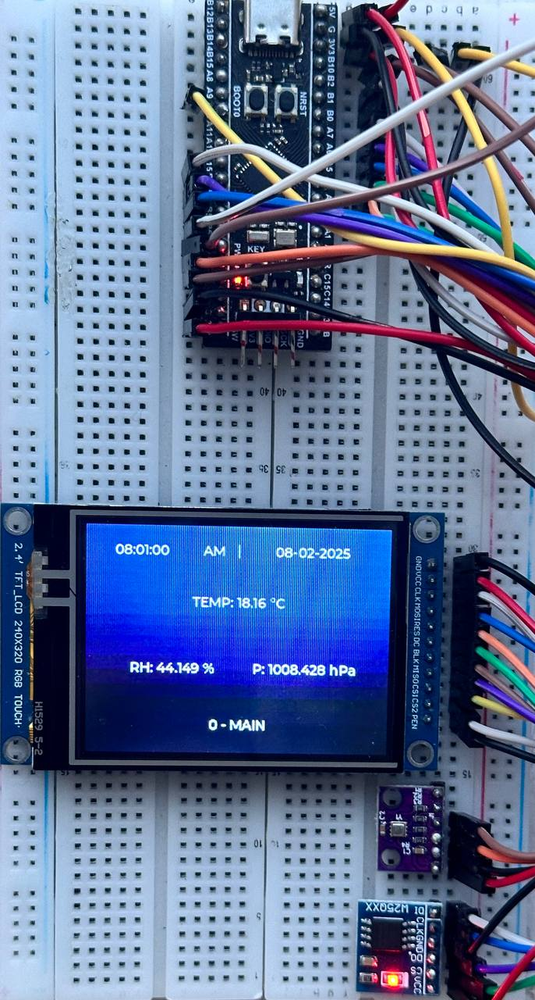

# Data Collection and Storage System for Environmental Monitoring

  

This project implements a data collection and storage system for monitoring environmental conditions using a **STM32F411CEU6** microcontroller. The system collects data from a **BME280** sensor (temperature, humidity, pressure), stores the data in a **W25Q64** flash memory, and displays the data on an **ILI9341 TFT** display with **XPT2046 touch support**. Additionally, data is periodically transmitted over **UART** for PC verification, and time synchronization is achieved using the hardware RTC of the microcontroller.

## Technologies Used:
- **STM32 HAL/LL Libraries**
- **SPI, I2C, UART Communication**
- **RTC for Time Synchronization**
- **BME280, W25Q64, ILI9341, XPT2046** for hardware integration

---

## Features:
- Reads temperature, humidity, and pressure data from the **BME280** sensor using **SPI**.
- Stores the data in the **W25Q64** flash memory using **I2C**.
- Periodically updates the display with real-time data.
- Saves the date and time of each reading (using the hardware RTC).
- Transmits the data over **UART** to a PC for verification.

## Communication Protocols:
- **SPI1**: Communication with **BME280** sensor.
- **I2C**: Communication with **W25Q64** flash memory.
- **UART**: Data transmission to PC.

  
  

## Compatibility:
- Compatible with **STM32F411CEU6**.
- Libraries used: **LL** (Low-Layer Libraries).

## Screens:
- **Main Screen**: Displays real-time data, synchronized with the RTC.
- **Temperature, Humidity, and Pressure Screens**: Displays dynamic graphs for live sensor data and static graphs for archived data from flash memory, based on user-selected time range.

  

## Hardware Components:
1. **Main Controller**:
   - **STM32F411CEU6**.
   
2. **Peripheral Devices**:
   - **BME280** (SPI) – Temperature, Humidity, and Pressure Sensor.
   - **W25Q64** (SPI) – Flash memory for non-volatile data storage.
   - **TFT ILI9341** – Display for data visualization.
   - **Touch XPT2046** – Touchscreen interface for navigation.

3. **Additional Components**:
   - **USB-TTL Converter** for UART communication.
   - **Dupont Wires** for connections.
   - **USB Power Supply**.

  
  
  

