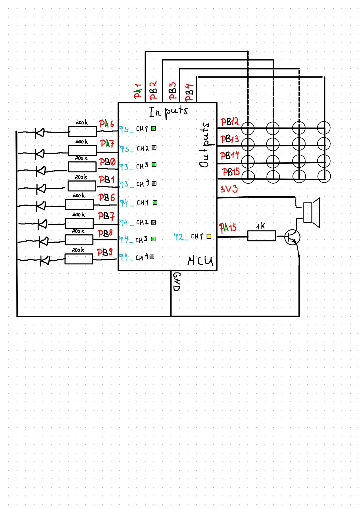

# Pulse Width Modulation (PWM) and Melody Control

This project implements control of the brightness of two LEDs and the playback of notes and melodies using a matrix keyboard (HC-35). The actions are assigned to the keys as described below.

## Technologies Used

- **Microcontroller**: STM32
- **Peripherals**: 
  - LED PWM for brightness control.
  - Matrix Keypad for user input.
  - Timer for note generation using a square wave (meander signal).
- **Audio Playback**: Generating notes via timer-based PWM for sound frequencies.

---

## Features

- **LED Brightness Control**: 
  - Increase or decrease the brightness of two LEDs connected to pins.
- **Note Playback**: 
  - Play predefined notes (from 1 to 8) when corresponding buttons are pressed.
- **Melody Playback**: 
  - Play predefined melodies (1 to 4) when corresponding buttons are pressed.
- **Matrix Keypad (HC-35)**: 
  - Controls the above functionalities.

## Key Assignments

| Button | Action |
|--------|--------|
| K1     | Increase brightness of the first LED |
| K2     | Decrease brightness of the first LED |
| K3     | Increase brightness of the second LED |
| K4     | Decrease brightness of the second LED |
| K5     | Play note 1 while pressed |
| K6     | Play note 2 while pressed |
| K7     | Play note 3 while pressed |
| K8     | Play note 4 while pressed |
| K9     | Play note 5 while pressed |
| K10    | Play note 6 while pressed |
| K11    | Play note 7 while pressed |
| K12    | Play note 8 while pressed |
| K13    | Start playing melody 1 |
| K14    | Start playing melody 2 |
| K15    | Start playing melody 3 |
| K16    | Start playing melody 4 |

### Brightness Adjustment:
- **Single click**: Adjusts the brightness by 10%.
- **Long press**: Continuously increases or decreases the brightness.

### Melody Control:
- When a melody starts playing, pressing any note or melody button stops the current melody and starts the new action.
- Melodies are played sequentially, with note frequencies and durations defined in external files (`melody_<n>.h` and `melody_<n>.c`).

### Melody Files:
- Each melody is stored in separate files containing three global variables:
  - `MELODY_<N>_LEN` – Number of notes in the melody.
  - `MELODY_<N>_FREQUENCIES` – Frequencies of the notes in Hertz.
  - `MELODY_<N>_DURATIONS` – Duration of each note.

- Frequency of each note can be 0, which represents a pause instead of a note.

# Circuit:

