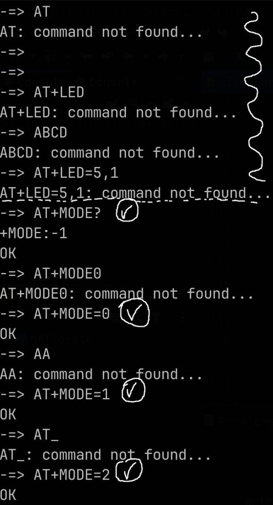
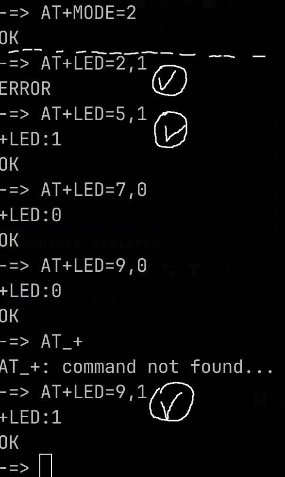

# AT Command Processor

## Overview

This project implements an AT command processor over the UART interface. The microcontroller receives AT commands, processes them, and responds accordingly. The system uses circular buffers for efficient data handling and interrupt-based UART communication.
## Technologies Used

- **UART** for communication.
- **Interrupt-driven programming** for efficient data handling.
- **Circular buffers** for managing UART data flow.
- **ARM Cortex-M (STM32)** as the target microcontroller.

---

## AT Command Protocol

### Client Requests and Device Responses

#### Example Commands

```
AT+MODE=1
OK

AT+MODE?
+MODE: 1
OK

AT+MODE=234
ERROR

AT+BTNSTATE
+BTNSTATE: 0
OK
```

### Available Commands

| Command      | Description                                                                      |
| ------------ | -------------------------------------------------------------------------------- |
| `AT+BTNCLK`  | Retrieves the number of button (PA\_0) clicks since the microcontroller started. |
| `AT+MODE?`   | Queries the current operating mode.                                              |
| `AT+MODE=x`  | Sets the operating mode (`0`, `1`, or `2`).                                      |
| `AT+LED=x`   | Queries the state of LED `x`.                                                    |
| `AT+LED=x,y` | Controls LED `x` (0 = OFF, 1 = ON). Only works in mode `2`.                      |

### LED Modes

- `0` – Two adjacent LEDs rotate clockwise.
- `1` – Two adjacent LEDs rotate counterclockwise.
- `2` – Individual LED control mode (using `AT+LED`).


## Tests




